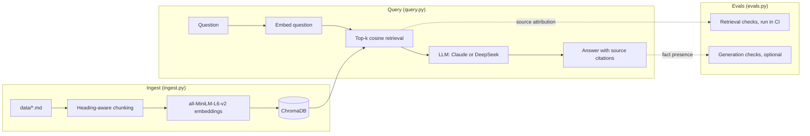

# rag-observability — RAG over Observability Docs

[](https://github.com/redbarron23/rag-observability/actions/workflows/ci.yml)
[](LICENSE)


A Retrieval-Augmented Generation system that answers natural-language questions about multi-cloud observability architecture, coverage targets, and monitoring standards.

Ask questions and get **cited answers** grounded in the actual documentation:

```
Q: What is the coverage target for Tier 1 production resources?
A: The production Tier 1 coverage target is 85% within 4 months and 100%
   within 9 months (source: coverage-targets.md, section 'Tier 1').
```

## Architecture at a glance



## Quick start

```bash
# 1. Set up
python -m venv .venv && source .venv/bin/activate
pip install -r requirements.txt

# 2. Set your API key (DeepSeek is default)
export DEEPSEEK_API_KEY=sk-...
# Or for Claude:
# export ANTHROPIC_API_KEY=sk-...

# 3. Ingest — reads data/*.md, chunks, embeds, stores in local ChromaDB
python ingest.py

# 4. Ask questions (default provider: DeepSeek; see Environment variables)
python query.py "What are the coverage targets for Azure production?"

# 5. Or use DeepSeek instead
python query.py --provider deepseek --model deepseek-chat "Explain the observability framework"

# 6. Set provider via environment variable (no flag needed each time)
export LLM_PROVIDER=deepseek
export LLM_MODEL=deepseek-chat
python query.py "What are the top monitoring gaps?"

# 7. Interactive REPL
python query.py

# 8. Run evals (retrieval only — no API key needed)
python evals.py

# Full evals with DeepSeek
LLM_PROVIDER=deepseek LLM_MODEL=deepseek-chat python evals.py --with-llm
```

---

## The RAG pipeline (detailed)

```
                    INGEST (ingest.py)
                    ==================

                                     ┌──────────────────┐
                                     │  data/*.md       │
                                     │  sample corpus   │
                                     └────────┬─────────┘
                                              │
                                              ▼
                                     ┌──────────────────┐
                                     │ load_documents() │
                                     │ Walks data/      │
                                     │ recursively,     │
                                     │ skips <50 chars  │
                                     └────────┬─────────┘
                                              │
                                              ▼
                                     ┌──────────────────────────────────────┐
                                     │ chunk_text_simple(text, chunk_size) │
                                     │                                     │
                                     │ Groups paragraphs into chunks of    │
                                     │ ~600 chars each.  Each chunk gets   │
                                     │ a heading breadcrumb so it's        │
                                     │ self-contained when retrieved:      │
                                     │                                     │
                                     │   "Coverage Targets > Tier 1        │
                                     │                                     │
                                     │    The Tier 1 target is 90%..."     │
                                     └────────┬────────────────────────────┘
                                              │
                                              ▼
                                     ┌──────────────────────────────────────┐
                                     │ SentenceTransformer                 │
                                     │ all-MiniLM-L6-v2                    │
                                     │                                     │
                                     │ Each chunk → 384-dim vector         │
                                     │ Runs locally, model downloaded      │
                                     │ once from HuggingFace               │
                                     └────────┬────────────────────────────┘
                                              │
                                              ▼
                                     ┌──────────────────────────────────────┐
                                     │ ChromaDB (local vector store)       │
                                     │                                     │
                                     │ Collection: "observability-docs"    │
                                     │ Distance:  cosine                   │
                                     │                                     │
                                     │ Each entry:                         │
                                     │   id:        chunk-0000             │
                                     │   embedding: [384 floats]           │
                                     │   document:  "chunk text..."        │
                                     │   metadata:  {"source": "file.md",  │
                                     │                "section": "Title"}  │
                                     │                                     │
                                     │ Persisted to chroma_db/ on disk     │
                                     └──────────────────────────────────────┘


                    QUERY (query.py)
                    ================

    "What are the coverage targets?"
              │
              ▼
    ┌─────────────────────┐
    │ Embed the question  │
    │ (same model)        │
    └────────┬────────────┘
             │
             ▼
    ┌───────────────────────────────────────────────┐
    │ ChromaDB: cosine similarity search            │
    │ Returns top-4 chunks with their source/section│
    └────────┬──────────────────────────────────────┘
             │
             ▼
    ┌───────────────────────────────────────────────┐
    │ Build context with source citations           │
    │                                               │
    │ [Chunk 1] Source: coverage-targets.md         │
    │           Section: Tier 1                     │
    │ The production Tier 1 coverage target...      │
    │                                               │
    │ [Chunk 2] Source: tagging-standard.md         │
    │           Section: Required tags              │
    └────────┬──────────────────────────────────────┘
             │
             ▼
    ┌───────────────────────────────────────────────┐
    │ LLM (DeepSeek by default)                    │
    │                                               │
    │ Prompt: "Answer using ONLY this context.      │
    │          Cite source and section for each     │
    │          claim."                              │
    │                                               │
    │ System: "Do NOT use any external knowledge."  │
    └────────┬──────────────────────────────────────┘
             │
             ▼
    "The Tier 1 target is 85% within 4 months
     (source: coverage-targets.md, section 'Tier 1')."
```

---

## File reference

| File | Purpose |
|---|---|
| `ingest.py` | One-shot ingestion pipeline: load → chunk → embed → store |
| `query.py` | Retrieval + generation: `RAGEngine` class with `retrieve()` and `answer()` |
| `evals.py` | 10 eval cases: source attribution (retrieval-only, no API key) and fact presence (`--with-llm`) |
| `tests/` | Unit tests for loading and chunking (`pytest`) |
| `.github/workflows/ci.yml` | CI: unit tests, ingest sample corpus, retrieval evals |
| `chroma_db/` | Persisted vector store, regenerated by `ingest.py` (in `.gitignore`) |
| `data/` | Sample corpus: 8 fictional markdown docs for a made-up company (replace with your own) |

### Environment variables

| Variable | Purpose | Default |
|---|---|---|
| `LLM_PROVIDER` | LLM provider (`deepseek` or `anthropic`) | `deepseek` |
| `LLM_MODEL` | Model name (provider-specific) | `deepseek-chat` or `claude-sonnet-4-6` |
| `DEEPSEEK_API_KEY` | API key for DeepSeek | required for `deepseek` |
| `ANTHROPIC_API_KEY` | API key for Claude | required for `anthropic` |

Copy `.env.example` as a starting point.

### CLI flags

| Flag | Purpose | Default |
|---|---|---|
| `--provider` | Override LLM_PROVIDER for one query | env var |
| `--model` | Override LLM_MODEL for one query | env var |
| `--n-results` | Number of chunks to retrieve | `4` |
| `--verbose`, `-v` | Show retrieved chunks before the answer | `False` |
| `--persist-dir` | ChromaDB persistence directory | `chroma_db` |

---

## Chunking strategy

`chunk_text_simple()` in `ingest.py` is the core design choice. Key decisions:

### Heading-aware breadcrumbs

Each chunk prepends its parent headings as a breadcrumb trail. This means a chunk about Tier 1 coverage targets starts with `Coverage Targets > Tier 1` even when retrieved in isolation — it's self-contained.

```python
heading_stack: list[str] = []

def _section_context() -> str:
    return " > ".join(h for h in heading_stack if h)
```

When the parser hits a `## Tier 1` heading, it updates the stack and flushes any in-progress chunk:

```python
heading_match = re.match(r"^(#{2,4})\s+(.+)", line)
if heading_match:
    _flush()  # save current chunk
    level = len(heading_match.group(1))  # 2 for ##
    title = heading_match.group(2).strip()
    # Update stack depth: ## -> depth 1, ### -> depth 2
    target = level - 1
    while len(heading_stack) > target:
        heading_stack.pop()
    heading_stack.append(title)
```

### Paragraph grouping, not character splitting

Documents are split on paragraph boundaries (blank lines), not mid-sentence. A paragraph either fits in the current chunk or starts a new one:

```python
para_len = len(stripped)
if current_len + para_len > chunk_size and current_paragraphs:
    _flush()
current_paragraphs.append(stripped)
current_len += para_len
```

This avoids the common RAG pitfall of chunks that start or end mid-sentence, which confuse the LLM.

### No overlap

The simpler `chunk_text_simple()` function (which is actually used — `chunk_text()` is dead code) has no character overlap between chunks. The heading breadcrumb provides enough context that overlap isn't needed.

---

## Embedding model

`all-MiniLM-L6-v2` is a sentence-transformer model that maps sentences and paragraphs to 384-dimensional vectors. It's:

- **Small** — ~80MB, runs on CPU in a few seconds
- **Popular** — the most-downloaded model on HuggingFace, well-tested
- **English-optimized** — sufficient for technical documentation
- **Locally executed** — no API call, no data leaves your machine during embedding

The model is downloaded once on first run and cached locally (that's the `HF_TOKEN` warning — HuggingFace now requires authentication for higher rate limits, but the model is public).

---

## Retrieval: how it works

`RAGEngine.retrieve()` in `query.py`:

```python
def retrieve(self, query: str, n_results: int = 4) -> list[dict]:
    # 1. Embed the question with the same model used for ingestion
    query_embedding = self.embedder.encode([query]).tolist()[0]

    # 2. Cosine similarity search in ChromaDB
    results = self.collection.query(
        query_embeddings=[query_embedding],
        n_results=n_results,
    )

    # 3. Package results with source/section metadata
    chunks = []
    for i in range(len(results["ids"][0])):
        chunks.append({
            "id": results["ids"][0][i],
            "text": results["documents"][0][i],
            "source": results["metadatas"][0][i].get("source", "unknown"),
            "section": results["metadatas"][0][i].get("section", ""),
            "distance": results["distances"][0][i] if "distances" in results else None,
        })
    return chunks
```

The distance score (cosine similarity) is available but not used for filtering — the top-4 are always returned regardless of score. In a production system you'd add a similarity threshold to avoid returning irrelevant chunks.

---

## Generation: the cited answer

`RAGEngine.answer()` constructs a prompt from the retrieved chunks, then delegates to `_call_llm()` which routes to the configured provider.

### Provider selection

The provider is determined by (in priority order):
1. `--provider` CLI flag
2. `LLM_PROVIDER` environment variable
3. Default: `anthropic`

```python
DEFAULT_PROVIDER = "anthropic"
DEFAULT_MODEL = "claude-sonnet-4-6"

PROVIDER_DEFAULT_MODELS = {
    "anthropic": "claude-sonnet-4-6",
    "deepseek": "deepseek-chat",
}
```

### Anthropic path

Uses `anthropic.Anthropic().messages.create()` with the `system` parameter for the system prompt.

### DeepSeek path (OpenAI-compatible)

Uses `openai.OpenAI()` pointed at `https://api.deepseek.com`. The system prompt is injected as the first `{"role": "system"}` message in the messages array (OpenAI convention).

### System prompt (same for both providers)

```python
SYSTEM_PROMPT = """You are an observability domain expert assistant.

You answer questions based ONLY on the provided context documents.
If the context does not contain enough information to answer, say so clearly.

For every factual claim, cite the source document and section in parentheses.
Be concise and precise — this is technical infrastructure knowledge.

Do NOT use any external knowledge. Stick strictly to what the retrieved
chunks contain."""
```

Three constraints enforced:
1. **No external knowledge** — if it's not in the retrieved chunks, the model must say so
2. **Citation required** — every factual claim must cite its source
3. **Precision** — technical infrastructure docs need exact numbers and references

### User prompt template

```python
f"""Answer the following question using ONLY the context below.
Cite the source document and section for each claim you make.

Question: {query}

Context:
{context}"""
```

---

## Evaluation strategy

`evals.py` tests 10 queries against known ground truth in the sample corpus. Each eval checks **two dimensions:**

### Dimension 1: Source attribution

Did the RAG system retrieve chunks from the correct document(s)?

```python
sources_ok = all(
    expected in str(retrieved_sources)
    for expected in ev["expected_sources"]
)
```

**Example:** A question about tagging standards should return chunks from `tagging-standard.md`, not from `observability_framework.md`.

### Dimension 2: Fact presence

Does the generated answer contain the expected factual content?

```python
for fact in ev["expected_facts"]:
    if fact.lower() not in answer.lower():
        facts_ok = False
```

**Example:** A question about coverage targets must mention "90%", "6 months", "100%", and "12 months" — the specific thresholds from the document.

### Why both checks?

Most RAG evals only check retrieval recall (did we get the right chunks?). But a system that retrieves the right document and then hallucinates a wrong answer still fails in production. Conversely, a system that gets the facts right but cites the wrong source is also broken — attribution errors erode user trust.

The dual check catches both failure modes:

| Retrieval | Facts | Outcome |
|---|---|---|
| ✅ Correct source | ✅ Correct facts | **PASS** |
| ✅ Correct source | ❌ Hallucinated | **FAIL** — fact error |
| ❌ Wrong source | ✅ Correct facts | **FAIL** — attribution error |
| ❌ Wrong source | ❌ Wrong facts | **FAIL** — both errors |

### The 10 eval cases

| ID | Question | Expected source | Expected facts |
|---|---|---|---|
| `coverage-targets-tier1` | Tier 1 production target | `reference/coverage-targets.md` | 85%, 4 months, 100%, 9 months |
| `coverage-targets-gcp` | Current GCP coverage | `reference/coverage-targets.md` | 0.47%, 40% |
| `framework-scoring` | Scoring model | `architecture/observability_framework.md` | Missing, Basic, Good, Excellent |
| `framework-categories` | Framework categories | `architecture/observability_framework.md` | Metrics, Logs, Traces, Alerts, SLO, Ownership |
| `gcp-azure-metrics-differences` | GCP vs Azure metrics | `reference/gcp-azure-metrics-comparison.md` | Ops Agent, Azure Monitor Agent |
| `tagging-standard` | Resource tagging | `reference/tagging-standard.md` | owner, cost-centre, environment |
| `tracing-use-cases` | Distributed tracing | `architecture/observability_tracing_use_cases.md` | dependency, latency |
| `data-first-approach` | Data freshness | `data-first-approach.md` | 6 hours |
| `observability-setup` | Onboarding a service | `observability-setup-primer.md` | owning team, SLO |
| `cost-smoothing` | Log Analytics cost plan | `programme/COST_SMOOTHING.md` | 20%, three waves |

### Latest results

| Mode | Cases | Passed |
|---|---|---|
| Retrieval (source attribution), no API key | 10 | 10 (100%) |
| Full, generation with DeepSeek (fact presence) | 10 | 9 (90%) |

The one miss (`tracing-use-cases`) is a generation failure, not a retrieval failure: the right chunk was retrieved, but the answer omitted the expected terms. Retrieval evals run in CI.

Retrieval-only evals run in CI and exit non-zero on any failure. All 10 pass locally (top-6 retrieval).

---

## Usage examples

```bash
# Ingest with custom chunk size
python ingest.py --data-dir data --chunk-size 600

# Single query (default provider)
python query.py "What are the top monitoring gaps identified?"

# Verbose — shows the retrieved chunks before the LLM answer
python query.py --verbose "Explain the observability framework"

# Specify provider and model per-query
python query.py --provider deepseek --model deepseek-chat "What is the scoring model?"

# Control how many chunks are retrieved (default: 4)
python query.py --n-results 6 "What is the process for running a gap analysis?"

# Use environment variables to set provider persistently
export LLM_PROVIDER=deepseek
export LLM_MODEL=deepseek-chat
python query.py "What are the tagging standards?"

# Interactive REPL (shows active provider at startup)
python query.py

# Run evals (retrieval only — no API key needed)
python evals.py
python evals.py --verbose

# Full evals with fact-presence checks (requires API key)
python evals.py --with-llm
```

## Data handling

`data/` ships with a small **fictional** sample corpus (a made-up "Contoso Cloud" observability programme) so the project runs out of the box and CI can verify retrieval. `chroma_db/` is generated from it and is in `.gitignore`.

To use your own documents:

```bash
# Replace the sample corpus with your markdown files (any directory structure)
rm -r data && cp -r /path/to/docs data

# Re-ingest (safe to re-run; the collection is rebuilt each time)
python ingest.py

# Query
python query.py "Your question here"
```

Update the cases in `evals.py` to match your documents. Don't commit confidential documents to a public repo.

---

## What this project demonstrates

| Concept | Implementation |
|---|---|
| **RAG pipeline** | End-to-end: ingest → chunk → embed → store → retrieve → generate |
| **Semantic chunking** | Heading-aware paragraph grouping with breadcrumb context |
| **Vector search** | ChromaDB with cosine similarity, `all-MiniLM-L6-v2` |
| **Cited generation** | LLM constrained to answer only from retrieved context, with mandatory source citations |
| **Provider abstraction** | `LLM_PROVIDER`/`LLM_MODEL` env vars or `--provider`/`--model` CLI flags; works with Anthropic and DeepSeek |
| **RAG evals** | Dual checks: source attribution + fact presence in generated answer |
| **Local-first** | Embedding runs locally on CPU; only the LLM call hits an API |

## Requirements

- Python 3.10+
- For generation, one of (retrieval and evals need no key):
  - `DEEPSEEK_API_KEY` for DeepSeek (default provider)
  - `ANTHROPIC_API_KEY` for Claude

### Dependencies

```
chromadb>=0.5.0
sentence-transformers>=2.2.0
anthropic>=0.50.0
openai>=1.0.0
```

## License

MIT

## References

- [ChromaDB — vector database](https://www.trychroma.com/products/chromadb) — the open-source embedding database used as the vector store in this project
- [RAG 101: Demystifying Retrieval-Augmented Generation Pipelines](https://developer.nvidia.com/blog/rag-101-demystifying-retrieval-augmented-generation-pipelines/) — NVIDIA blog post covering the fundamentals of RAG architecture, chunking strategies, embedding models, and evaluation
- [Sentence Transformers](https://www.sbert.net/) — library and model hub for dense vector embeddings (`all-MiniLM-L6-v2`)
- [Evaluating RAG: A Comprehensive Guide to Metrics and Methods](https://www.rungalileo.io/blog/evaluating-rag-a-comprehensive-guide-to-metrics-and-methods) — covers the dual-attribution eval strategy used in this project's `evals.py`
- [LangSmith RAG Evaluation](https://docs.smith.langchain.com/faq/evaluation/eval_rag) — production-grade RAG eval patterns (correctness, faithfulness, relevance)
